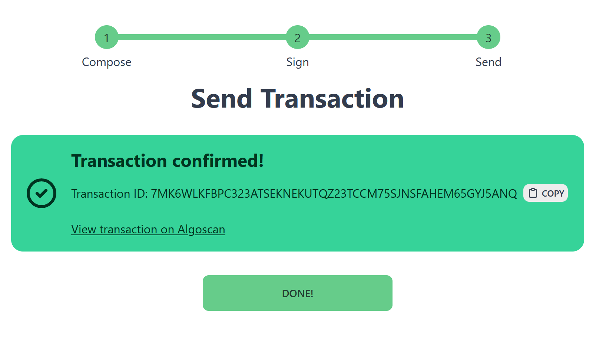

## Abstract

The “Transaction Builder UI” (name not final) will be an online tool that provides an easy and user-friendly way to create just about any transaction on Algorand. Creating and sending a transaction on Algorand without an existing tool for that particular type of transaction requires using the SDK or `goal`, which requires programming knowledge and/or a node setup. Just about every wallet makes simple payment transactions easy. However, many of the more advanced transactions are either difficult or impossible within the wallets’ UIs. This creates a large gap where a non-programmer user cannot conveniently use many of Algorand’s more advanced features. The purpose of the Transaction Builder UI is to fill in this gap.

## Team

### No-Cash-7970

A lone web developer for over 10 years. In September 2021, she became interested in Algorand and has been a tiny part of the Algorand community ever since as an active member of the Algonauts Official Discord group.

## Experience with Algorand

### No-Cash-7970’s experience

- Using and experimenting with the JavaScript and Python SDKs
- Built a working prototype game using Reach

## Roadmap

**Q4 2023** - The Transaction Builder UI will be available to the public to use to create payment, key registration, asset configuration, asset freeze, asset transfer, and application call transactions.

## Benefits for the community

Having an easy-to-use user interface (UI) for creating and sending transactions of almost any level of difficulty would make Algorand an easier blockchain to use. More advanced and complex transactions would be easier and safer for users of various knowledge levels to create and send. Easier access to Algorand’s more advanced features will make Algorand a more useful tool for more people. An easy-to-use UI would also allow users to obtain a better understanding of what transaction(s) they are sending and how transactions work in general.

## Additional information

### Project features &amp; requirements

#### User interface and user experience

- Focused. The Transaction Builder UI is solely tool for creating Algorand transactions.
- Simple. Building an Algorand transaction can get very complex very quickly, so the UI shouldn’t add to that complexity. However, the UI shouldn’t completely hide complex details either. Allow the user to see more of the details if they want to.
- Show and explain transaction details and the transaction fields, if user desires. The Transaction Builder UI may be used as an education tool.
- The UI should be easy to use across various devices and screen sizes.
- Safe defaults. The safest options are set as the default.
- Allow the user to easily use and switch between MainNet, TestNet, and BetaNet.
- Allow the user to specify a custom `algod` node.

#### Economics and finance

- The user must not be charged a fee other than the Algorand network fee(s).
- The need for a web server should be kept to a minimum. Preferably, the Transaction Builder UI wouldn’t need a back-end web server, so cost of maintaining the Transaction Builder UI is as low as possible.

#### Security and privacy

- No personal information is to be collected and stored.
- Never directly collect or store a user’s private key or passphrase. Use a trustworthy wallet service to connect to a user’s wallet.
- The software must not access funds or ASAs without the user’s permission.

#### Development

- For Algorand only.
- Code must be open source and available to the public, preferably in a publicly accessible Git repository like GitHub.
- Code should be well documented, usually through code comments and some external documentation, such as a README.
- Code should be well organized.
- Project should have "clean code"; in other words, it shouldn’t have more code than necessary for the software to function well.

#### Legal

- <a href="https://mit-license.org/">MIT</a> or <a href="https://github.com/aws/mit-0/blob/master/MIT-0">MIT No Attribution (MIT-0)</a> license.
- No liability or warranty.
- Do whatever with the code.
- Request: Please don’t scam, defraud, or otherwise harm others using this code or some derivative of this code.

### Mockups

#### Composing an application call transaction

#### Composing a key registration transaction

#### Transaction signed but not sent yet

#### Transaction successfully sent

### Similar projects

#### Stellar Laboratory

Simply stated on the website:
> The Stellar Laboratory is a set of tools that enables people to try out and learn about the Stellar network.

Stellar Laboratory has a few tools, including a transaction builder. It is the inspiration for this project.

- **Blockchain**: Stellar (XLM)
- **Website**: <a href="https://laboratory.stellar.org/">https://laboratory.stellar.org/</a>

#### Dappflow Composer

From <a href="https://app.dappflow.org/dashboard">Dappflow’s Dashboard page</a> as of May 9, 2023:
> Composer your atomic transactions with intuitive transaction builder.

Dappflow is a suite of online tools for Algorand development. One of the tools is *Composer*, a transaction builder. *Composer* at this time has limited functionality, and doesn’t allow the user to create more advanced transactions like a key registration transaction.

- **Blockchain**: Algorand (ALGO)
- **Website**: <a href="https://app.dappflow.org/composer">https://app.dappflow.org/composer</a>

#### Create Bitcoin Transaction

From the website’s disclaimer:
> This bitcoin transaction composer & viewer tool allows to easily create/visualize any kind of "standard" and "non-standard" bitcoin (BSV) transaction, and it’s for testing and **EDUCATIONAL PURPOSES ONLY !!**.

This tool is only does two things: build transactions and view transactions. It appears it was created in 2021. As of May 4, 2023, the version is v0.143 beta.

- **Blockchain**: Bitcoin Satoshi Vision (BSV), Bitcoin (BTC)
- **Website**: <a href="https://createbitcointransaction.com/">https://createbitcointransaction.com/</a>
